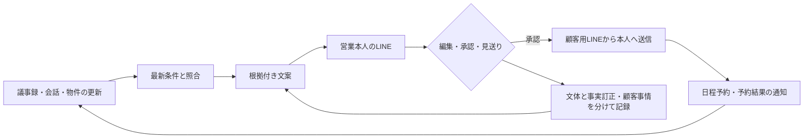

# TSUNAGU — 次のご連絡を、あなたの言葉で。

議事録と商品情報の変化から、顧客に合う理由と文案を準備する営業アシスタント。営業がLINEで編集・承認・見送りを選び、本人が承認した文面を顧客へ届けます。

## 実際に試す

**[Googleでログインして体験する](https://tsunagu-gs-integration.shimoryo.workers.dev/demo)**

- [手順書・3つのQRコード](https://tsunagu-gs-integration.shimoryo.workers.dev/demo-guide.html)
- [営業役の通知用LINE（@876qqbck）](https://lin.ee/yV6rgH7)
- [お客様役のLINE（@302klzlz）](https://line.me/R/ti/p/%40302klzlz)
- [詳しい体験手順と困ったときの対応](demo/LIVE-DEMO.md)

運営の同席・招待なしで、約10人がそれぞれ自分のLINEへ送信する提出用環境です。初回は10〜15分、GoogleアカウントとスマートフォンのLINEを用意してください。

**Googleログイン → 2つのLINEの本人確認 → 新しい議事録をLINEで紐付け・解析 → 物件追加（台帳にも保存） → 自動提案 → 編集・承認 → 自分のLINEで受信 → TimeRex予約 → 予約通知 → 取消**

TimeRexは実際に日時を確保します。体験後に必ず取り消してください。LINEとの対応を引き継ぐため、予約は提案文・体験画面の専用リンクから開きます。

予約通知が未接続の場合、画面に「接続準備中」と表示します。接続と通し確認の進捗は[検証記録](reports/SELF-SERVICE-DEMO-2026-10-04.md)に記載しています。

## 管理・営業・運営の全画面見学

**[demo@example.com でログイン](https://tsunagu-gs-showcase.shimoryo.workers.dev/login)** — パスワード・確認コードは不要です。公開の架空データを使った見学用アカウントです。

ログイン後の「画面一覧・導入フロー」から、今日の提案・顧客・面談結果・接続設定・導入設定・運営管理など、全19画面へ移れます。各画面に役割と通常の操作を表示します。保存・送信・外部接続は停止しています。自分のLINEへの実送信には、Googleログインの体験画面を使ってください。

[全画面の役割・企業への導入フロー](demo/SCREENS-AND-ONBOARDING.md)

## どこに価値があるか

毎回顧客を探し、会話を読み返し、文章生成ボタンを押す手間を減らします。情報更新を捉え、いま連絡する理由を作り、営業の判断をLINEへ集めます。



学習は、承認済み事例を次回の生成へ渡すfew-shot方式です。事実訂正を文体として覚えたり、ある顧客の事情を別の顧客へ転用したりしないように分離します。文章品質の改善は実測の対象であり、1回の編集での改善を保証しません。

## このリポジトリの構成

公開用に切り出した、実際のG’sデモの実装です。認証情報・運用DB・実参加者の記録・個人LINE IDは含めていません。

| 場所 | 役割 |
|---|---|
| `src/product/SelfDemo.jsx` | 同席不要の体験ガイド・本人確認・議事録・提案・予約画面 |
| `backend/self-demo*.ts` | 参加枠・本人確認・個人データ・予約結果の処理 |
| `backend/assistant*.ts` | 条件照合・根拠検証・文案・担当者通知・学習 |
| `backend/gs-harness*.ts` | G’s専用LINE受信・プロフィール・本人確認の返信 |
| `backend/customer-test-delivery.ts` | 本人確認済みの自己宛送信・送信結果の記録 |
| `backend/booking.ts` | TimeRex予約と既存の面談台帳・顧客状態の接続 |
| `backend/migrations/` | D1のスキーマ変更 |
| `tests/` | 利用者間の分離・競合・重複防止・文案の根拠等のテスト |
| `demo/` | 体験手順・提出文・印刷可能なHTMLガイド |
| `reports/SELF-SERVICE-DEMO-2026-10-04.md` | 検証済みと実機確認待ちを分けた記録 |

技術はReact、TypeScript、Hono、Cloudflare Workers / D1、Google OAuth / Drive / Sheets、LINE Messaging API、TimeRex、OpenAIです。

## 手元でコードと画面を確認

Node.js 22以上を推奨します。

```sh
npm ci
npm run typecheck
npm test
npm run preview:demo
```

`http://127.0.0.1:4188/demo` を開きます。ローカルプレビューは架空のログイン・LINE・AIデータを使う画面確認用で、実際のLINE送信・AI呼び出し・TimeRex予約を行いません。実機の往復体験には上記の公開URLを使ってください。

`npm run build` で本番用の画面と配布ガイドを生成できます。Cloudflareへ別環境を構築する場合は `wrangler.gs-integration.example.jsonc` と `.env.example` を参照し、自分のD1、Google、LINEの設定を用意します。資格情報はGitへ保存せずSecretとして設定します。この公開ツリーから、提出環境の設定を書き換えるコマンドは提供していません。

## 送信とデータの扱い

- 体験者は自分の議事録・会話・判断だけにアクセスできます。架空の共通素材は共有します。
- 2つのLINEは各々本人確認します。友だち追加だけで他人へ送れるようにはなりません。
- 追客文は最新版の承認後に送信し、送信直前にも顧客・会話・物件の変化を確認します。
- 通信が切れて送信結果が分からない場合、自動で再送しません。
- 予約結果は、認証済みのTimeRexイベントから作る固定の通知です。
- AIは体験者1人1日12回、既存の検証管理者は100回、全体300回。顧客向け送信は予約通知込みで1日8回。実サービスの利用枠も適用されます。

新しい議事録は通知用LINEで紐付け先を確認し、承認後に解析します。画面から加えた物件は接続中のスプレッドシートへ保存し、同じIDで往復させます。シートへ直接加えた共通物件も検知します。通知が有効な体験中は約30〜60秒間隔で確認します。

新しい議事録は通知用LINEのカードから自分の顧客へ紐づけできます。画面から追加した体験用物件は共通のGoogleスプレッドシートへ保存され、Sheetから追加した物件も自動検知します。画面を開いて通知が有効な間は約30〜60秒を目安に情報元を確認し、AI処理完了後に文案が届きます（生成時間・APIの混雑分は別途必要）。画面を閉じても1分間隔の定期処理を継続します。重複追加・通知を防ぎ、保存の確認中は提案に使いません。

共通のDrive議事録から取り込んだ個人メモはコピーです。コピーの編集は自動解析しますが、共通原本の更新をコピーへ継続同期する機能ではありません。通常営業画面では、紐付けたDrive原本の自動同期を使えます。

リサーチ・Googleカレンダー・再連絡時期の機能もコードに含まれます。今回の無人デモの中心は議事録・物件・LINE・TimeRexです。PDF/ExcelのAI抽出は実機検証対象外です。
